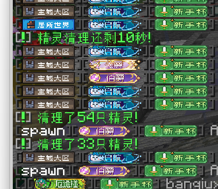

# 贴图字体

> **💡 功能说明**
> 此功能允许将特定**文字**替换为 `texture` 文件夹下的**贴图**。
> - 支持静态图片和 **GIF 动态图片**。
> - **建议**：在 UI 设计中，更推荐直接使用**图片控件**。

## 配置方法

> **📁 配置文件**：`config/FontConfig.yml`

```yaml
# 示例：将生僻字“囖”替换为一张图片
囖:
  texture: "http://www.xggames.cn/minecraft/VIP/0.png" # 支持网络URL或本地路径，如 "texture/icons/coin.png"
  width: 10    # 【必填】贴图显示的宽度
  height: 10   # 【必填】贴图显示的高度
  fontWidth: 9 # 【必填】替换后占用的文字宽度
  offsetX: 5   # 横向偏移量
  offsetY: 5   # 纵向偏移量
  color: true  # 为true时，只有带颜色代码(如 §a)的文字才会被匹配替换
  single: false # 重要：对于多字词组（如"金币"），false表示将整个词替换为一张图；true则表示每个字单独替换
```
## 参数详解
- 配置后，当文本中出现 囖 字时，它将被显示为指定的图片。
- texture: 图片路径，支持本地路径（如 texture/ui/icon.png）或完整的网络URL。
- width & height: 定义图片显示的实际尺寸。
- fontWidth: 此图片在文本流中占据的字符宽度，用于对齐。
- offsetX & offsetY: 微调图片显示位置。
- color: true: 这是一个关键限制条件。通常需要配合颜色代码使用，例如在文本中输入 §a囖，这个绿色的“囖”字才会被替换成图片。这可以避免所有普通的“囖”字都被意外替换。
- single: false: 处理多字词的关键。以“金币”为例：false 会将“金币”作为一个整体替换成一张图片；true 则会尝试将“金”和“币”每个字都单独替换一次（通常这不是我们想要的效果）。
## 展示
 